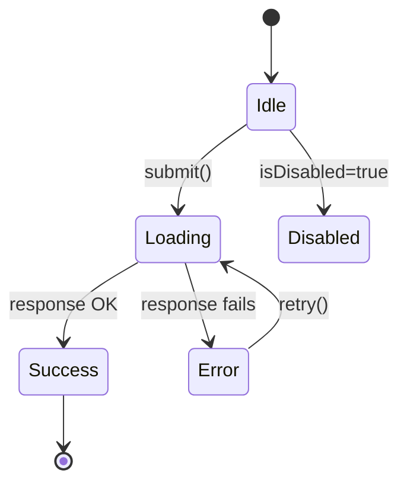

# UI Component Design

## Purpose
Design and implement reusable, accessible, well-typed UI components following established patterns.

## Step 1: Define the Props Interface

Start with the type contract. This is the component's public API — get it right before writing any JSX.

```ts
// ✅ Good: specific, typed, documented, uses consistent naming
interface ButtonProps {
  /** The button's visible label */
  children: React.ReactNode;
  /** Visual style variant */
  variant?: 'primary' | 'secondary' | 'danger' | 'ghost';
  /** Prevents interaction and applies disabled styling */
  isDisabled?: boolean;
  /** Shows a spinner and prevents interaction */
  isLoading?: boolean;
  /** Accessible label when children isn't descriptive */
  'aria-label'?: string;
  /** Called when the button is clicked (not fired when disabled/loading) */
  onClick?: (event: React.MouseEvent<HTMLButtonElement>) => void;
}

// ❌ Avoid: stringly-typed, vague, imperative naming
interface BadButtonProps {
  text: string;           // should be children
  type: string;           // should be a union
  disabled: boolean;      // should be isDisabled (boolean props start with is/has/can)
  handleClick: Function;  // should be onClick, not handleClick
}
```

**Naming conventions:**
- `onX` for event callbacks: `onClick`, `onChange`, `onClose`
- `isX` / `hasX` / `canX` for booleans: `isDisabled`, `hasError`, `canEdit`
- `defaultX` for uncontrolled defaults: `defaultValue`, `defaultOpen`

---

## Step 2: Choose a Pattern

| Pattern | When to use | Example |
|---------|-------------|---------|
| **Presentational** | Pure display, no logic | `Avatar`, `Badge`, `Spinner` |
| **Controlled** | Parent owns state | `<Input value={v} onChange={fn} />` |
| **Uncontrolled** | Component owns state, parent gets notified | `<Input defaultValue="x" onChange={fn} />` |
| **Compound** | Related pieces that share implicit state | `<Tabs>`, `<Select>`, `<Accordion>` |
| **Render prop / slot** | Flexible content injection | `<Modal header={<Title />}>` |

```tsx
// Compound component example — Tabs
function Tabs({ children, defaultTab }: TabsProps) {
  const [active, setActive] = useState(defaultTab);
  return <TabsContext.Provider value={{ active, setActive }}>{children}</TabsContext.Provider>;
}

Tabs.List = function TabsList({ children }: { children: ReactNode }) { ... };
Tabs.Tab  = function Tab({ id, children }: TabProps) {
  const { active, setActive } = useContext(TabsContext);
  return <button aria-selected={active === id} onClick={() => setActive(id)}>{children}</button>;
};
Tabs.Panel = function TabPanel({ id, children }: TabPanelProps) {
  const { active } = useContext(TabsContext);
  return active === id ? <div role="tabpanel">{children}</div> : null;
};

// Usage
<Tabs defaultTab="profile">
  <Tabs.List>
    <Tabs.Tab id="profile">Profile</Tabs.Tab>
    <Tabs.Tab id="settings">Settings</Tabs.Tab>
  </Tabs.List>
  <Tabs.Panel id="profile"><ProfileForm /></Tabs.Panel>
  <Tabs.Panel id="settings"><SettingsForm /></Tabs.Panel>
</Tabs>
```

---

## Step 3: Map All States

Before writing code, enumerate every state the component can be in:

```
default → loading → success
                  → error → (retry) → loading
default → disabled (terminal)
```

As Mermaid:


Each state needs a visual representation. Never leave a state unhandled:

```tsx
function SubmitButton({ isLoading, isDisabled, isError, children, onClick }: Props) {
  if (isLoading) return <button disabled aria-busy="true"><Spinner /> Loading…</button>;
  if (isError)   return <button onClick={onClick} className="error">⚠ Retry</button>;
  return (
    <button
      onClick={onClick}
      disabled={isDisabled}
      aria-disabled={isDisabled}
    >
      {children}
    </button>
  );
}
```

---

## Step 4: Accessibility Checklist

Apply this checklist to every interactive component:

```
Semantic HTML
  [ ] Uses the correct HTML element as the base (button not div, nav not div)
  [ ] Heading levels are correct relative to page context

Keyboard Navigation
  [ ] All interactive elements reachable via Tab
  [ ] Enter / Space activates buttons and links
  [ ] Escape closes modals, dropdowns, tooltips
  [ ] Arrow keys navigate within menus, tabs, sliders, radio groups
  [ ] Focus is visible (never outline: none without a custom focus style)

ARIA
  [ ] role="" only added when semantic HTML doesn't exist
  [ ] aria-label or aria-labelledby on icon-only buttons/inputs
  [ ] aria-expanded on triggers for collapsible regions
  [ ] aria-controls links trigger to its panel
  [ ] aria-live="polite" on regions that update dynamically (toasts, status)
  [ ] aria-busy="true" on loading containers

Focus Management
  [ ] Opening a modal moves focus inside it
  [ ] Closing a modal returns focus to the trigger
  [ ] Focus is trapped inside modal while open (Tab cycles within)

Color & Contrast
  [ ] Text contrast ≥ 4.5:1 (WCAG AA) — test with browser DevTools
  [ ] Interactive state not communicated by color alone
  [ ] Error states include text, not just a red border
```

---

## Step 5: Composition Over Configuration

Keep the API surface small. Use composition for variants instead of a growing list of boolean props.

```tsx
// ❌ Avoid: prop explosion
<Button primary large leftIcon="star" rounded loading />

// ✅ Better: composable
<Button variant="primary" size="lg" isLoading>
  <StarIcon aria-hidden /> Save
</Button>
```

---

## Output Checklist

For each component, deliver:

1. **TypeScript interface** — props with JSDoc on each field
2. **State diagram** — all states and transitions
3. **Implementation** — with inline comments on non-obvious logic
4. **Usage examples** — happy path + edge cases (empty, loading, error, disabled)
5. **Accessibility checklist** — filled out for this specific component
