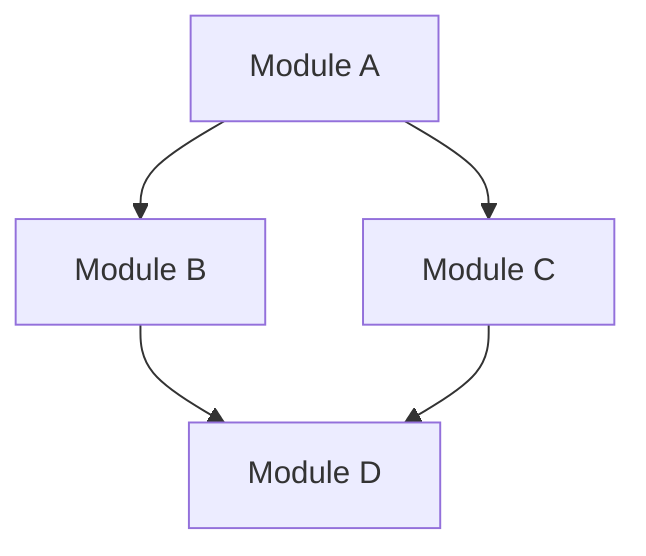

# Dependency Graph

## Purpose
Analyze and visualize module dependencies within a project, identify circular dependencies, and highlight areas of high coupling.

## Instructions

### 1. Scan Imports
- Identify the import/require/include mechanism for the project's language
- Scan source files for import statements
- Build a map of: file -> [list of internal dependencies]
- Exclude external/third-party dependencies unless requested

### 2. Build the Graph
- Create an adjacency list of module relationships
- Identify directionality (A depends on B)
- Group modules by directory or package

### 3. Detect Circular Dependencies
- Traverse the dependency graph looking for cycles
- A circular dependency exists when A -> B -> ... -> A
- Report the full cycle path for each detected cycle
- Rate severity: direct cycles (A <-> B) are worse than indirect (A -> B -> C -> A)

### 4. Identify High Coupling
- Count incoming dependencies (afferent coupling) for each module
- Count outgoing dependencies (efferent coupling) for each module
- Flag modules with unusually high coupling in either direction
- High afferent = many dependents (risky to change)
- High efferent = depends on many things (fragile)

### 5. Generate Mermaid Diagram
Create a Mermaid diagram showing the dependency structure:


For large projects, generate focused diagrams per package/directory rather than one massive graph.

### 6. Recommendations
- Suggest how to break circular dependencies
- Identify candidates for interface extraction
- Recommend module boundaries that reduce coupling

## Output Format
```
## Dependency Analysis: [project/module]

### Statistics
- Total modules: [count]
- Total dependencies: [count]
- Circular dependencies: [count]

### Circular Dependencies
1. [A] -> [B] -> [C] -> [A]

### High Coupling Modules
| Module | Dependents | Dependencies | Notes |
|--------|-----------|-------------|-------|
| [name] | [count] | [count] | [observation] |

### Dependency Diagram
[Mermaid diagram here]

### Recommendations
1. [Suggestion to reduce coupling or break cycles]
```
