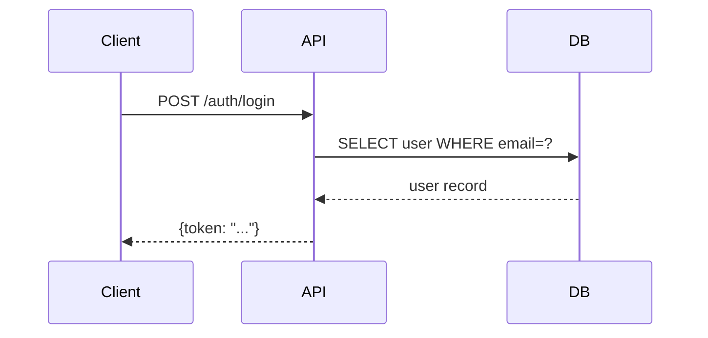

# Technical Writing Standards

## Purpose
Guide the creation of clear, consistent technical documentation for any audience: developers, end users, or operations teams.

## Audience-Specific Approach

### Developer Docs
Include code examples, architecture context, API references. Assume technical vocabulary.

**Before:**
> The system uses an event-driven approach for handling user actions.

**After:**
> User actions emit events to a Redis Pub/Sub channel. Consumers subscribe via `EventBus.on('user.action', handler)` and process events asynchronously. Failed handlers retry 3 times with exponential backoff before writing to a dead-letter queue at `events:dlq:{userId}`.

### End-User Docs
Focus on tasks and outcomes. Avoid jargon. Use "you" and imperative verbs.

**Before:**
> The authentication module supports SSO via SAML 2.0 and OIDC protocols.

**After:**
> You can sign in with your company account. Click **Sign in with SSO**, enter your work email address, and you'll be redirected to your company's login page.

### Operations / Runbooks
Cover deployment, monitoring, troubleshooting. Lead with commands and expected outputs.

**Before:**
> High memory usage can occur when the cache is not properly configured.

**After:**
> **Symptom**: RSS memory > 4 GB on the API server.
> **Check**: `curl http://localhost:9090/metrics | grep cache_size_bytes`
> **If cache_size_bytes > 2GB**: `redis-cli -h $REDIS_HOST FLUSHDB` — this clears the cache and causes a 2-3 minute latency spike while it warms.

---

## Writing Principles

- Active voice: "The server returns 200" not "A 200 is returned"
- Lead with the most important information (inverted pyramid)
- One idea per paragraph, 3–5 sentences max
- Be specific: "takes ~200ms" not "is fast", "raises `AuthError`" not "may fail"
- Define acronyms on first use: "Content Delivery Network (CDN)"
- Use second person ("you") for instructions

---

## Document Templates

### Tutorial / How-To
```markdown
# [Task title starting with a verb: "Set Up X", "Configure Y"]

Brief one-sentence description of what the reader will accomplish.

## Prerequisites
- [Requirement 1 — be specific: "Node.js 18+" not "Node.js installed"]
- [Requirement 2]

## Step 1: [Verb phrase]
[One sentence explaining why this step is needed]

```bash
exact-command --with-flags
```

Expected output:
```
what they should see
```

## Step 2: [Verb phrase]
...

## Next Steps
- Link to related task
- Link to reference docs
```

### Reference Page (API, config, CLI)
```markdown
# `functionName(param1, param2)`

One-sentence description of what it does.

**Parameters**

| Name | Type | Required | Description |
|------|------|----------|-------------|
| `param1` | `string` | Yes | What it controls |
| `param2` | `number` | No | Default: `30`. Max value: `300`. |

**Returns**: `Promise<ResultType>` — description of the resolved value.

**Throws**: `AuthError` if the token is expired. `RateLimitError` if > 100 req/min.

**Example**
```ts
const result = await functionName('value', 60);
```
```

### Runbook
```markdown
# [Incident / Alert Name]

**Severity**: P1 / P2 / P3
**On-call rotation**: [link]

## Symptoms
- [ ] Error rate > X% on `/api/...`
- [ ] Alert: `HighMemoryUsage` firing

## Diagnosis

```bash
# Check error logs
kubectl logs -l app=api --tail=100 | grep ERROR

# Check memory
kubectl top pods -l app=api
```

## Resolution

### Option A: [Most common fix]
```bash
kubectl rollout restart deployment/api
```
Wait 2 minutes, then verify: `curl https://api.example.com/health`

### Option B: [Escalation path]
Page the [team] via PagerDuty.

## Post-Incident
- [ ] Write post-mortem within 24 hours
- [ ] File follow-up ticket for root cause
```

---

## Code Examples

- Show the command AND expected output
- Use realistic values: `user@example.com`, not `foo@bar.com`
- Mark placeholders: `<your-api-key>`, `${PROJECT_ID}`
- Include the error case when it's non-obvious

```bash
# Good: shows context, realistic value, expected output
$ curl -H "Authorization: Bearer <your-token>" \
    https://api.example.com/v1/users/me

{"id": "usr_123", "email": "alice@example.com", "role": "admin"}

# Error case
$ curl -H "Authorization: Bearer expired-token" \
    https://api.example.com/v1/users/me

{"error": "token_expired", "message": "Token expired at 2024-01-15T10:00:00Z"}
```

---

## Visual Aids

Use Mermaid for flows and architecture. Keep diagrams to one concept each.



Use tables for comparisons and reference data — not for prose that happens to have two columns.

Use admonitions for callouts:
```markdown
> **Note**: This only applies to accounts created after March 2024.

> **Warning**: Running this command drops the `sessions` table.

> **Tip**: Use `--dry-run` to preview changes before applying them.
```
