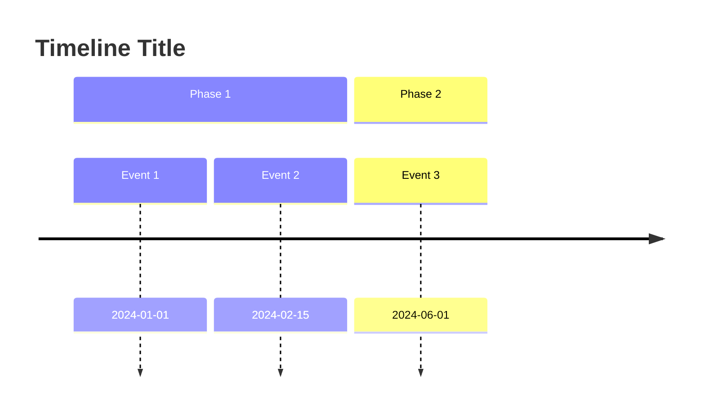

# Timeline Creation

## Purpose
Extract events with dates from provided content and create clear visual
timelines using Mermaid diagrams, highlighting key milestones and patterns.

## Instructions

1. **Extract Events**
   - Parse the provided content for dates and associated events
   - Normalize date formats to a consistent style (YYYY-MM-DD)
   - Capture: date, event title, brief description, category (if applicable)
   - Ask for clarification on ambiguous dates or events

2. **Sort Chronologically**
   - Order all events by date, earliest first
   - Handle same-day events by logical ordering or time if available
   - Note the total time span covered

3. **Identify Key Milestones**
   - Mark significant events that represent turning points
   - Identify phases or eras within the timeline
   - Group related events into sections
   - Note the beginning and end of major phases

4. **Detect Patterns**
   - Identify gaps (long periods with no events)
   - Find clusters (many events in short periods)
   - Note recurring events or cycles
   - Highlight overlapping activities

5. **Create Mermaid Timeline Diagram**
   - Use the appropriate Mermaid diagram type:
     - `timeline` for milestone-based views
     - `gantt` for duration-based views with overlaps
   - Add clear labels and section groupings
   - Use consistent formatting for dates

6. **Add Context**
   - Annotate events with relevant context
   - Note external factors that influenced timing
   - Include duration for events that span time ranges
   - Add links or references where applicable

## Output Format

Provide both a structured list and a visual diagram:

```
# Timeline: [Subject]

## Event List
| Date | Event | Category | Notes |
|------|-------|----------|-------|
| YYYY-MM-DD | Event name | Category | Context |

## Key Milestones
1. Date - Milestone description

## Diagram



## Observations
- Patterns, gaps, and clusters noted
```
